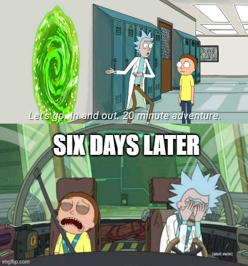

```{r setup, include=FALSE}
knitr::opts_chunk$set(echo = TRUE)
```
# Introduction

Have you noticed that tasks always take longer than you think they will? Well, if you have, you’re in good company, because according to research, that’s what happens to literally everybody, literally all the time. From popping to the shops to get some milk, to massive transnational infrastructure projects, wherever a human being is called upon to estimate how long it’ll take them to do something, you’ll find the “planning fallacy”; the tendency to underestimate how long a task will take.



The weird thing about the planning fallacy is that we all have a lot of experience of being wrong about our estimates, but keep being wrong next time anyway. As a species our temporal over-optimism has been refuted continually for millennia; you’d think we would have gotten better at this by now. Why is the planning fallacy so tenacious, and how many times can we be wrong until we learn our lesson and start making better estimates?

*Alarums. Enter Renzo Borgatti.*


Borgatti is a software engineer and certified absolute madlad who, just for fun, estimated how long every single work task would take him for almost ten straight years, along with how long it actually took him. He also very generously made this data publicly available so nerds like us could make a load of graphs and maybe see if we can learn something about psychology from him.

The planning fallacy is fascinatingly resistant to prior experience, so the question we wanted to answer was this: is ten straight years with multiple instances of feedback every day enough to overcome it? And if his estimates did improve, did they only improve for tasks he had to repeat, or - more tantalisingly - is it possible to improve one’s general purpose estimation ability so that it transfers even to novel tasks?

But before we look at that, here’s some background on what we actually know about the planning fallacy from research so far.

# Why Do We Suck at Planning?


The tendency to make over-optimistic estimates was first noted by Kahneman and Tversky in a 1979 paper, in which they coined the term planning fallacy. Their explanation, which has proven to be very robust over decades of subsequent research, is that when we make plans, we rely on the ‘inside view’ instead of the ‘outside view’ of the task. 


When we adopt the inside view, we think about what will need to be done to complete the project, imagine doing all those things, and then estimate how long that would take. This is very intuitive, but we tend to imagine all our tasks being done in perfect conditions by infallible versions of ourselves, and don’t take into account the innumerable things that could go wrong or delay completion.


When we take the outside view, on the other hand, we consider how long similar tasks have taken in the past. This provides a more realistic basis for estimates of tasks which must be conducted in a chaotic world, where competing priorities and unexpected problems are commonplace. 


Kahneman and Tversky point out that any single one of the innumerable things that could go wrong is usually pretty slim, which is perhaps why we don’t take them into account, but the sheer number of them means that almost inevitably some stumbling block will arise during the course of a project. For instance, the probability of me grappling on a flight with a poorly designed cup holder and spilling a cup of lemonade onto my laptop, preventing me from making progress in writing this blog, is - by itself - very low. However the total number of things which might have delayed me is very high. A very large number of small probabilities usually equals a fair chance that something will go awry. 

However, interventions intended to make people adopt the outside view must be very heavy handed to work - making people recall how long similar projects took in the past is not enough; you also have to explicitly make them think about how their past experiences should help them make predictions about the present project (Buehler et al., 1994).

We tend to attribute past successes to permanent internal qualities (like intelligence, willpower, etc.) but past failures to specific, temporary, external characteristics; instances of bad luck (like being forced to grapple with a poorly engineered cup holder on a flight). This maintains the view that unfavourable circumstances are the exception rather than the norm; the causes of past problems are seen as unlikely to reoccur, while the causes of past success are seen as durable.

Ironically, because the planning fallacy is caused by this inside view, interventions intended to expedite project completion, which mostly encourage more detailed planning, may just backfire. Similarly, the fallacy is exaggerated in people with a greater propensity to plan (Lynch et al., 2010), and those who are more goal-focused (Pezzo, Litman, & Pezzo, 2006).

Also in accordance with this explanation, a greater duration and/or complexity of a task also exacerbates the effect of the planning fallacy. This is a well-replicated result across many task types and time scales, and makes sense; the longer the timescale and the more moving parts a project relies on, the higher the potential for unanticipated disruptions.

The planning fallacy is surprisingly ubiquitous. It seems to be independent of culture, personality traits, and tendency to procrastinate (people who procrastinate more correctly predict that tasks will take them longer than those who do not procrastinate, but both groups are over-optimistic (Pychyl et al., 2000). It is also not associated with mood or confidence, and not modified in experiments by inducing demand characteristics. Though there is some evidence - not fortuitously for most organisations - that it is intensified in people with power.

There was some evidence that feedback helps to reduce the planning fallacy - at least for similar tasks - but studies which have tested this have only used feedback over very short timescales with very few instances of feedback (e.g. Cornelius et al., 2015; Roy et al., 2008).

# About the Dataset

As noted, this dataset covered a span of almost ten years of work days. It consisted of the date, an identifier number for each unique task description (the actual task descriptions themselves were hidden as they contained private details about Borgatti’s work), the estimated duration of the task, and the actual duration of the task. Task durations were measured in ‘pomodoros’ - units of 25 minutes. A column also indicated whether tasks were completed on the day they were planned or not. 

# Predictions, Let’s Make Some Predictions


1. The first and most obvious prediction is that the planning fallacy would be observed.

2. We also predicted that, in line with the overwhelming majority of the research on the subject, this would be exaggerated for longer tasks (i.e. tasks that Borgatti predicted would take him longer). 

3. We predicted that the sheer amount of feedback that Borgatti was getting from this project would mean that said planning fallacy would reduce over time - at the very least for repeated tasks,

4. And lastly, we tentatively predicted that this improvement would also eventually transfer to novel tasks; that a general purpose increase in the estimation accuracy for novel tasks would increase over time. 

# Results (AKA The ‘We Were Wrong About a Whole Bunch of Stuff’ Section)

The first surprise was that there was no overall tendency towards the planning fallacy; on average, task durations were overestimated, not underestimated. The planning fallacy was observed, but, running counter to prior research, only for very short - single pomodoro - tasks, and only to a very small degree on average. In another flagrant insult to our very reasonable and well-justified predictions, with longer task lengths, overestimation actually increased. It was almost as though Borgatti hadn’t familiarised himself with the relevant psychological research and didn’t know what his brain was supposed to be doing.


As for the next prediction; whether repeated experience with a specific task led to increased estimation accuracy, the answer was yes! The more Borgatti had completed a task in the past, the better his estimations were. We explored the time horizon for this effect and found that the relationship between total task experience and accuracy increased for up to 5.5 months prior, beyond which the effect began to decrease. 


Our final and spiciest prediction was that feedback would eventually lead to an increased general purpose estimation ability. Was this borne out in the data? 

…No. Actually, it seems that Borgatti got significantly worse over time at estimating novel tasks!


This tendency was towards increasing overestimation.

Estimate performance also decreased across the dataset according to two other measures: the probability of completing a planned task on a given day, and the accuracy in estimating the amount of actual time spent working on a given day.


# What Gives?

Naturally the next question that occurred to us as diligent data scientists was: huh?

There are a few potential explanations as to why Borgatti didn’t exhibit the planning fallacy. The first is suggested by the fact that he was already using a similar system which provided feedback on his estimations for about 2 years prior to the start of the available dataset; perhaps an initial planning fallacy was corrected in that period.

Secondly, because the dataset records predictions on the amount of time spent on a task, rather than predictions about completion time, it doesn’t reflect one of the main drivers of the planning fallacy, namely failing to take into account task-external delays to completion. 

Task external delays prevent time being spent on a task, but not how long a task takes. This means that if Borgatti had to attend an emergency dentist appointment, or, say,  had to grapple with a poorly engineered cup holder on a flight and poured lemonade all over this laptop, even if the dentist appointment took a while or it took him a long time to get the laptop repaired, the time spent on these delays wouldn’t have contributed to the recorded total amount of time spent on his tasks that day.

Another possibility is that he was overestimating as a strategy to avoid repeated negative feedback. It feels good to finish a task on time and it’s stressful to finish late. Perhaps, either as a conscious strategy or a product of unconscious conditioning, he learned to make increasingly cautious estimates to reduce the stress or negative feedback. 

Finally, my favourite potential explanation, and one not yet ruled out by existing research, is that a minority of participants consistently overestimate in making duration estimates, even though the population mean is underestimation. 

No studies into estimation bias at the time of writing report whether there were any consistent overestimators amongst the participants, and White and Awadallah (2019), who examined data from the calendars of Microsoft employees, found that one of the strongest predictors of whether a task would be overestimated was the employee making the prediction, demonstrating that this is a stable trait with significant interpersonal variation. The authors do not mention whether there were any employees prone to consistent overestimation, leaving this an alluring possibility. 

The fact that overestimation increased with longer tasks is also mysterious; as noted this result runs contrary to almost all available research. The fact that the only other study which showed similar results also used software developers as participants (Hill et al., 2000) hints at a potential explanation; it’s possible that some aspect of the job means that software developers’ over-optimism doesn’t scale with task length. For instance, perhaps their tasks are unusually well-specified or people attracted to the job are psychologically unusual in some way not yet researched. This is a pretty tenuous hypothesis, though, and it may just be coincidence - there is some research which has documented the expected planning fallacy from software developers (e.g. van Oorschot et al., 2005)


# Limitations

Of course, the most obvious limitation is that the entire dataset comes from a single man. It’s impossible to know how representative of the general population he is, and considering that he spent ten years meticulously tracking every single work task in a huge and well-formatted dataset for fun… well I know what I think the answer is.

Another limitation is the aforementioned fact that he had already spent a couple of years using a similar system before the start of the dataset, and who knows how that affected things.

Finally, the crucial element we wanted to investigate in this naturalistic experiment was feedback, and whether enough of it would overcome the planning fallacy. But we don’t know how much Borgatti actually reflected on the difference between his estimate and actual task time. If he simply recorded his actual time with minimal conscious reflection, it barely counts as feedback at all, in which case this dataset cannot answer the question we posed to it.

# Future Directions

There are probably superestimators out there, a la Philp Tetlock’s Superforecasters, who really are able to accurately estimate the risk of delays and disruptions, and give good estimates based on this. It would be an interesting project to seek them out and interrogate them about how they make their estimations. If such people exist, probably a key aspect of their ability is intentionally taking the outside view. Taking the outside view - AKA considering the base rate - when making predictions is also a key feature of what Superforecasters do.

Whether repeated feedback on how long tasks actually take is enough to make better estimators of people is still a tempting prospect. It could be a fairly simple and valuable intervention to employ if so. Another research direction would be to get multiple participants to use a similar system to Borgatti, ensure that they are consciously reflecting on the feedback, and determine whether any general improvement in estimation ability is observed.

If you would like to read the whole project and see the code I used, you can do so here: https://github.com/Shinkai0202/PSY6009_Research_Project 

If you would like the original dataset along with a thoughtful analysis by Derek Jones, you can find those here: https://github.com/Derek-Jones/renzo-pomodoro 

# Special Thanks

Thanks to Renzo Borgatti for recording all this data and allowing it to be shared, and to Derek Jones for taking the initiative to investigate it in the first place, as well as for creating the Github repo which made the dataset available and interpretable. Special thanks also to my fantastic supervisor Tom Stafford, who is a lovely man with a giant brain and excellent hair.

# References

Buehler, R., Griffin, D., & Ross, M. (1994). Exploring the" planning fallacy": Why people underestimate their task completion times. Journal of personality and social psychology, 67(3), 366.

Hill, J., Thomas, L. C., & Allen, D. E. (2000). Experts’ estimates of task durations in software development projects. International Journal of Project Management, 18(1), 13–21.

Lynch Jr, J. G., Netemeyer, R. G., Spiller, S. A., & Zammit, A. (2010). A generalizable
scale of propensity to plan: The long and the short of planning for time and for
money. Journal of Consumer Research, 37(1), 108–128.

Pezzo, M. V., Litman, J. A., & Pezzo, S. P. (2006). On the distinction between yuppies and hippies: Individual differences in prediction biases for planning future tasks. Personality and Individual Differences, 41(7), 1359–1371.

Pychyl, T. A., Morin, R. W., & Salmon, B. R. (2000). Procrastination and the planning fallacy: An examination of the study habits of university students. Journal of Social Behavior and Personality, 15(5), 135.

van Oorschot, K. E., Bertrand, J. W. M., & Rutte, C. G. (2005). Field studies into the
dynamics of product development tasks. International Journal of Operations & Production Management, 25(8), 720–739. https://doi.org/10.1108/01443570510608574
